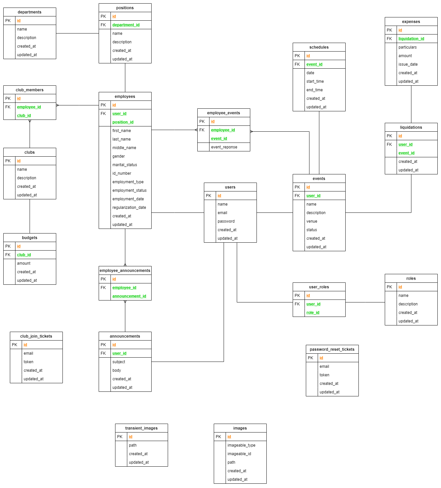
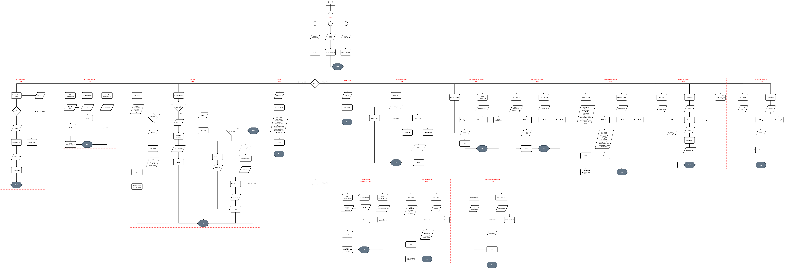

# REST version of EEMS (Employee Engagement Management System) application

This is a backend version of the EEMS (Employee Engagement Management System) application that only provides a REST API. 

This is using a **Laravel Framework** working for **Homestead**.

## Entity Relationship Diagram


## Flowchart


## Running the application locally

### Requirements
- php 7.2
- composer
- vagrant
- virtualbox
- ssh key

#### Setup for eems-api project
`git clone https://github.com/louislingatong/eems-server.git`
`cd eems-server`
`composer install`

### Setup for Homestead [(reference)](https://laravel.com/docs/5.8/homestead)

#### Install the vagrant box.
`vagrant box add laravel/homestead`

#### Install the homestead repository
`cd ~`
`git clone https://github.com/laravel/homestead.git Homestead`
`bash init.sh`

`vi Homestead.yaml`

Then, edit it like this.

```:bash
ip: "192.168.10.10"
memory: 2048
cpus: 2
provider: virtualbox

authorize: ~/.ssh/id_rsa.pub

keys:
    - ~/.ssh/id_rsa

folders:
    - map: C:/Development/eems-server
      to: /home/vagrant/eems-server

sites:
    - map: eems-server.local
      to: /home/vagrant/eems-server/public

databases:
    - eems

# ports:
#     - send: 50000
#       to: 5000
#     - send: 7777
#       to: 777
#       protocol: udp
```

And, edit your hosts file.

`vi /etc/hosts`

```
##
# Host Database
#
# localhost is used to configure the loopback interface
# when the system is booting.  Do not change this entry.
##
192.168.10.10 eems-server.local
```

#### Start up the vagrant
`cd ~/Homestead`
`vagrant up`

Then you will be able to access the site via your web browser.
`http://eems-server.local`
